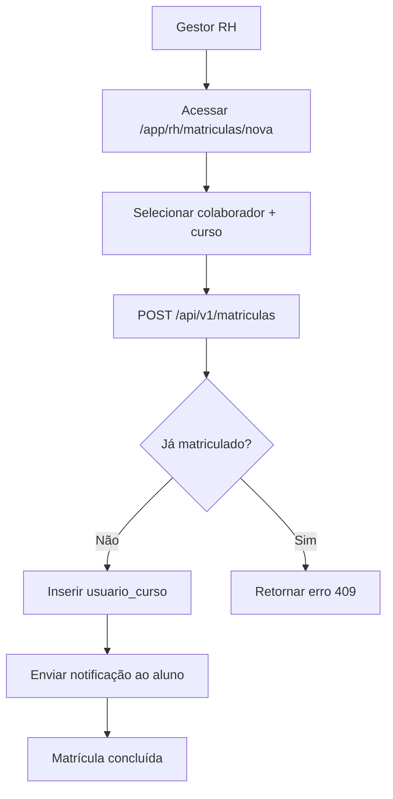
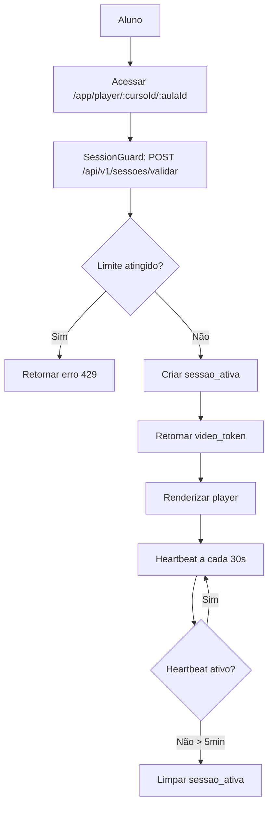
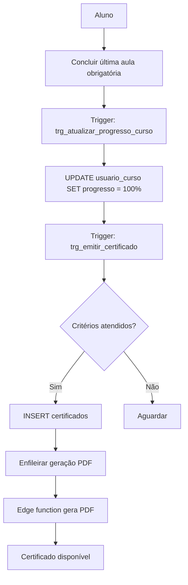
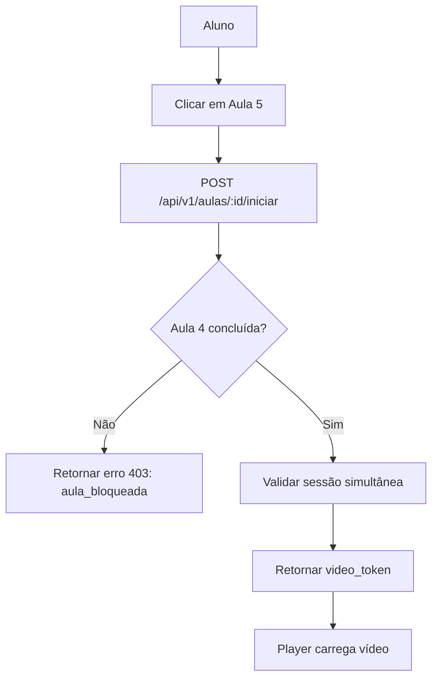

# LMS + B2B - Índice de Documentação Técnica

**Data:** 2026-02-27  
**Status:** Planejamento completo  
**Versão:** 1.0

---

## 1. Visão Geral

Este índice organiza toda a documentação técnica da expansão LMS + B2B do sistema CCI-CA. Os documentos estão organizados por categoria e incluem ordem de leitura sugerida.

**Modelo de Licenciamento:** Controle por usuários simultâneos ativos (sem consumo por matrícula)  
**Progressão:** Sequencial obrigatória (uma aula por vez)  
**Vídeos:** Bunny.net (opção C) com tokens temporários  
**Arquitetura:** Database-driven com RLS multi-tenant

---

## 2. Documentos por Categoria

### 2.1 📋 Requisitos e Planejamento Estratégico

| Documento                                                                    | Descrição                                                       | Última Atualização |
| ---------------------------------------------------------------------------- | --------------------------------------------------------------- | ------------------ |
| [mudancas.md](mudancas.md)                                                   | Documento mestre de requisitos e decisões técnicas              | 2026-02-27         |
| [ROADMAP_EXECUCAO_LMS_B2B.md](ROADMAP_EXECUCAO_LMS_B2B.md)                   | Roadmap de execução por fases com "Pronto quando"               | 2026-02-27         |
| [PLANO_MIGRATIONS_SQL_LMS_B2B.md](PLANO_MIGRATIONS_SQL_LMS_B2B.md)           | Sequência de migrações SQL com critérios de aceite              | 2026-02-27         |
| [PLANO_KICKOFF_GOVERNANCA_LMS_B2B.md](PLANO_KICKOFF_GOVERNANCA_LMS_B2B.md)   | Governança, RACI, ritos e critérios de entrada/saída            | 2026-02-27         |
| [BACKLOG_HISTORIAS_USUARIO_LMS_B2B.md](BACKLOG_HISTORIAS_USUARIO_LMS_B2B.md) | Backlog priorizado por fase com critérios de aceite             | 2026-02-27         |
| [PLANO_HOMOLOGACAO_UAT_LMS_B2B.md](PLANO_HOMOLOGACAO_UAT_LMS_B2B.md)         | Plano de homologação funcional por perfil e critérios de aceite | 2026-02-27         |

**Leitura Recomendada:**

1. mudancas.md (entender requisitos)
2. ROADMAP_EXECUCAO_LMS_B2B.md (entender fases)
3. PLANO_MIGRATIONS_SQL_LMS_B2B.md (entender ordem SQL)
4. PLANO_KICKOFF_GOVERNANCA_LMS_B2B.md (organização operacional da execução)
5. BACKLOG_HISTORIAS_USUARIO_LMS_B2B.md (planejamento tático por sprint)
6. PLANO_HOMOLOGACAO_UAT_LMS_B2B.md (validação funcional antes do go-live)

---

### 2.2 🗄️ Banco de Dados e Estrutura

| Documento                                                  | Descrição                                                 | Última Atualização |
| ---------------------------------------------------------- | --------------------------------------------------------- | ------------------ |
| [SCHEMA_TABELAS_LMS_B2B.md](SCHEMA_TABELAS_LMS_B2B.md)     | Schema completo: 15 tabelas com DDL, constraints, índices | 2026-02-27         |
| [FUNCOES_TRIGGERS_LMS_B2B.md](FUNCOES_TRIGGERS_LMS_B2B.md) | Funções RPC, triggers automáticos, jobs agendados         | 2026-02-27         |
| [POLITICAS_RLS_LMS_B2B.md](POLITICAS_RLS_LMS_B2B.md)       | Políticas Row-Level Security para multi-tenancy           | 2026-02-27         |
| [PLANO_RLS_LMS_B2B.md](PLANO_RLS_LMS_B2B.md)               | Visão estratégica de RLS com funções auxiliares           | 2026-02-27         |

**Ordem de Implementação:**

1. SCHEMA_TABELAS_LMS_B2B.md → Criar tabelas
2. FUNCOES_TRIGGERS_LMS_B2B.md (Seção 1) → Criar funções de apoio
3. POLITICAS_RLS_LMS_B2B.md → Habilitar RLS e criar políticas
4. FUNCOES_TRIGGERS_LMS_B2B.md (Seções 2-4) → Criar RPCs e triggers
5. FUNCOES_TRIGGERS_LMS_B2B.md (Seção 5) → Jobs agendados

---

### 2.3 🔐 Segurança e Permissões

| Documento                                            | Descrição                                                                     | Última Atualização |
| ---------------------------------------------------- | ----------------------------------------------------------------------------- | ------------------ |
| [MATRIZ_RBAC_LMS_B2B.md](MATRIZ_RBAC_LMS_B2B.md)     | Matriz completa de permissões por perfil (admin, professor, gestor_rh, aluno) | 2026-02-27         |
| [POLITICAS_RLS_LMS_B2B.md](POLITICAS_RLS_LMS_B2B.md) | Políticas SQL detalhadas por tabela                                           | 2026-02-27         |

**Perfis do Sistema:**

- `admin_interno` - Equipe CCI-CA (acesso global)
- `professor` - Criadores de conteúdo (multi-tenant)
- `gestor_rh` - Gestores de empresas (tenant-specific)
- `aluno` - Colaboradores/estudantes (tenant-specific)

---

### 2.4 🎨 Interface e Rotas

| Documento                                            | Descrição                                        | Última Atualização |
| ---------------------------------------------------- | ------------------------------------------------ | ------------------ |
| [MAPA_ROTAS_UI_LMS_B2B.md](MAPA_ROTAS_UI_LMS_B2B.md) | Rotas completas com guards, layouts, componentes | 2026-02-27         |
| [mapa_telas_modulos.md](../mapa_telas_modulos.md)    | Inventário de telas existentes no sistema        | 2026-02-27         |

**Aplicações:**

- `cci-ca-admin` - Admin interno + Professor
- `cci-ca-aluno` - Aluno + Gestor RH

**Guards Implementados:**

- AuthGuard (requer autenticação)
- RoleGuard (valida perfil)
- SessionGuard (valida simultaneidade)

---

### 2.5 🔌 API e Integrações

| Documento                                            | Descrição                                | Última Atualização |
| ---------------------------------------------------- | ---------------------------------------- | ------------------ |
| [ENDPOINTS_API_LMS_B2B.md](ENDPOINTS_API_LMS_B2B.md) | Especificação completa de endpoints REST | 2026-02-27         |

**Módulos de API:**

1. Empresas (CRUD + licenças)
2. Colaboradores (convites + gestão)
3. Cursos (criação + edição)
4. Módulos e Aulas (estrutura + vídeos)
5. Matrículas (individual + lote)
6. Sessões Ativas (validação + heartbeat)
7. Progresso (iniciar + concluir aulas)
8. Exercícios (responder + feedback)
9. Flashcards (revisão espaçada)
10. Certificados (emissão + validação)
11. Relatórios (progresso + conclusão)
12. Anotações (timestamped)
13. Webhooks (Bunny.net)

---

## 3. Fluxos Principais

### 3.1 Fluxo: Matrícula de Colaborador

**Documentos Relacionados:**

- ENDPOINTS_API_LMS_B2B.md → Seção 6.1
- FUNCOES_TRIGGERS_LMS_B2B.md → `rpc_matricular_usuario_no_curso`
- MATRIZ_RBAC_LMS_B2B.md → Seção 2.9

---

### 3.2 Fluxo: Acesso Simultâneo (Player de Aula)

**Documentos Relacionados:**

- MAPA_ROTAS_UI_LMS_B2B.md → Seção 3.3 (Player)
- ENDPOINTS_API_LMS_B2B.md → Seções 7.1, 7.2
- FUNCOES_TRIGGERS_LMS_B2B.md → `rpc_validar_acesso_simultaneo`
- SCHEMA_TABELAS_LMS_B2B.md → Tabela `sessoes_ativas`

---

### 3.3 Fluxo: Emissão Automática de Certificado

**Documentos Relacionados:**

- FUNCOES_TRIGGERS_LMS_B2B.md → `trg_emitir_certificado`
- SCHEMA_TABELAS_LMS_B2B.md → Tabela `certificados`
- ENDPOINTS_API_LMS_B2B.md → Seção 11

---

### 3.4 Fluxo: Progressão Sequencial (Aula Bloqueada)

**Documentos Relacionados:**

- FUNCOES_TRIGGERS_LMS_B2B.md → `rpc_iniciar_aula`
- mudancas.md → Seção 2.3 (Decisão: Progressão sequencial)
- MAPA_ROTAS_UI_LMS_B2B.md → Seção 3.3

---

## 4. Guia de Implementação

### Fase 1: Banco de Dados e Backend

**Duração Estimada:** 2-3 semanas

**Checklist:**

- [ ] Criar tabelas (SCHEMA_TABELAS_LMS_B2B.md)
- [ ] Criar funções de apoio RLS (FUNCOES_TRIGGERS_LMS_B2B.md - Seção 1)
- [ ] Habilitar RLS e criar políticas (POLITICAS_RLS_LMS_B2B.md)
- [ ] Criar RPCs transacionais (FUNCOES_TRIGGERS_LMS_B2B.md - Seções 2-3)
- [ ] Criar triggers (FUNCOES_TRIGGERS_LMS_B2B.md - Seção 4)
- [ ] Criar índices de performance (FUNCOES_TRIGGERS_LMS_B2B.md - Seção 6)
- [ ] Testes de RLS (POLITICAS_RLS_LMS_B2B.md - Seção 17)

**Pronto quando:**

- Todas as migrações SQL executadas sem erro
- Policies RLS testadas para cada perfil (isolamento tenant validado)
- RPCs retornam sucesso/erro conforme esperado
- Triggers atualizam progresso corretamente

---

### Fase 2: API e Integrações

**Duração Estimada:** 2-3 semanas

**Checklist:**

- [ ] Implementar endpoints de empresas (ENDPOINTS_API_LMS_B2B.md - Seção 2)
- [ ] Implementar endpoints de colaboradores (Seção 3)
- [ ] Implementar endpoints de cursos (Seção 4)
- [ ] Implementar endpoints de matrículas (Seção 6)
- [ ] Implementar endpoints de sessões (Seção 7)
- [ ] Implementar endpoints de progresso (Seção 8)
- [ ] Implementar endpoints de exercícios (Seção 9)
- [ ] Implementar endpoints de flashcards (Seção 10)
- [ ] Implementar endpoints de certificados (Seção 11)
- [ ] Implementar endpoints de relatórios (Seção 12)
- [ ] Integração Bunny.net (upload + webhook) (Seção 14)
- [ ] Testes de integração por endpoint

**Pronto quando:**

- Todos os endpoints retornam 200/201/204 em cenários de sucesso
- Erros 400/403/404/409/429 validados
- Rate limiting configurado
- Validação de schemas (Zod) implementada
- Integração Bunny.net funcional (upload + token temporário)

---

### Fase 3: Frontend - Admin e Professor

**Duração Estimada:** 3-4 semanas

**Checklist:**

- [ ] Implementar dashboard admin (MAPA_ROTAS_UI_LMS_B2B.md - Seção 1)
- [ ] Implementar CRUD de empresas (Seção 1.2)
- [ ] Implementar dashboard professor (Seção 2.1)
- [ ] Implementar CRUD de cursos (Seção 2.2)
- [ ] Implementar gerenciamento de módulos/aulas (drag-and-drop)
- [ ] Implementar uploader Bunny.net
- [ ] Implementar editor de mapas mentais
- [ ] Implementar CRUD de exercícios
- [ ] Implementar guards (Auth, Role) (Seção 9)
- [ ] Implementar layouts (Admin, Professor) (Seção 8)

**Pronto quando:**

- Admin interno consegue criar empresa e configurar limites
- Professor consegue criar curso completo (módulos + aulas + exercícios)
- Upload de vídeo funciona e exibe thumbnail após processamento
- Navegação por perfil funciona (sidebar correta)

---

### Fase 4: Frontend - Aluno e RH

**Duração Estimada:** 3-4 semanas

**Checklist:**

- [ ] Implementar dashboard aluno (MAPA_ROTAS_UI_LMS_B2B.md - Seção 3.1)
- [ ] Implementar catálogo de cursos (Seção 3.2)
- [ ] Implementar player de aula com controles (Seção 3.3)
- [ ] Implementar SessionGuard (validação simultaneidade) (Seção 9.3)
- [ ] Implementar heartbeat a cada 30s
- [ ] Implementar sistema de exercícios (Seção 3.4)
- [ ] Implementar flashcards com repetição espaçada (Seção 3.5)
- [ ] Implementar anotações timestamped (Seção 3.6)
- [ ] Implementar visualização de certificados (Seção 3.7)
- [ ] Implementar dashboard RH (Seção 4.1)
- [ ] Implementar gestão de colaboradores (Seção 4.2)
- [ ] Implementar matrículas (individual + lote) (Seção 4.3)
- [ ] Implementar painel de sessões ativas (realtime) (Seção 4.5)

**Pronto quando:**

- Aluno consegue acessar player e assistir vídeos sequencialmente
- Sistema bloqueia login ao atingir limite simultâneo (erro 429)
- Heartbeat mantém sessão ativa (limpeza após 5min de inatividade)
- Gestor RH consegue matricular colaboradores e monitorar progresso
- Painel de sessões ativas atualiza em tempo real (Supabase Realtime)

---

### Fase 5: Relatórios e Certificados

**Duração Estimada:** 1-2 semanas

**Checklist:**

- [ ] Implementar relatórios de progresso (ENDPOINTS_API_LMS_B2B.md - Seção 12)
- [ ] Implementar exportação CSV/PDF
- [ ] Implementar geração de PDF de certificado (Edge Function)
- [ ] Implementar validação pública de certificado (QR Code)
- [ ] Implementar trigger de emissão automática
- [ ] Testes de emissão de certificados

**Pronto quando:**

- Certificado é emitido automaticamente ao concluir curso
- PDF gerado com QR Code funcional
- Validação pública retorna dados corretos
- Relatórios RH exportam CSV/PDF com sucesso

---

### Fase 6: Testes e Ajustes

**Duração Estimada:** 1-2 semanas

**Checklist:**

- [ ] Testes E2E completos por perfil (Playwright)
- [ ] Testes de carga (sessões simultâneas)
- [ ] Testes de segurança (RLS bypass attempts)
- [ ] Ajustes de performance (índices, queries)
- [ ] Documentação de API (Swagger)
- [ ] Guia de onboarding para usuários

**Pronto quando:**

- Taxa de sucesso E2E >= 95%
- Tempo de resposta p95 < 500ms
- Nenhum bypass de RLS encontrado
- Documentação completa e revisada

---

## 5. Dependências Técnicas

### 5.1 Tecnologias

| Tecnologia        | Versão | Uso                      |
| ----------------- | ------ | ------------------------ |
| PostgreSQL        | 15+    | Banco de dados principal |
| Supabase          | Latest | Auth + RLS + Realtime    |
| React             | 18/19  | Frontend (admin/aluno)   |
| TypeScript        | 5+     | Tipagem                  |
| MUI               | v5/v6  | Componentes UI           |
| React Router      | v6     | Navegação                |
| TanStack Query    | v5     | Cache + queries          |
| Zod               | Latest | Validação de schemas     |
| Bunny.net         | -      | Streaming de vídeos      |
| Netlify Functions | -      | Serverless backend       |

### 5.2 Integrações Externas

| Serviço         | Propósito                                 | Documentação                          |
| --------------- | ----------------------------------------- | ------------------------------------- |
| Bunny.net Video | Hospedagem e streaming de vídeos privados | https://docs.bunny.net/docs/stream    |
| Zoho Meeting    | Aulas ao vivo (futuro)                    | https://www.zoho.com/meeting/api.html |

---

## 6. Glossário

| Termo                                | Definição                                                                           |
| ------------------------------------ | ----------------------------------------------------------------------------------- |
| **Sessão Ativa**                     | Conexão ativa de um aluno em um curso específico, validada por heartbeat a cada 30s |
| **Limite Simultâneo**                | Número máximo de alunos que podem estar logados simultaneamente na empresa          |
| **Heartbeat**                        | Requisição periódica (30s) que mantém a sessão ativa e atualiza `ultimo_heartbeat`  |
| **Progressão Sequencial**            | Modelo em que aulas devem ser concluídas em ordem (não pode pular)                  |
| **RLS (Row-Level Security)**         | Políticas PostgreSQL que filtram dados por tenant/usuário automaticamente           |
| **RBAC (Role-Based Access Control)** | Controle de acesso baseado em perfis (admin, professor, gestor_rh, aluno)           |
| **Multi-tenant**                     | Arquitetura que isola dados de múltiplas empresas no mesmo banco                    |
| **Flashcard**                        | Cartão de revisão gerado automaticamente ao errar exercício                         |
| **Bunny Video ID**                   | Identificador único do vídeo no Bunny.net                                           |
| **Video Token**                      | Token temporário (TTL 1h) para acesso ao vídeo privado                              |

---

## 7. Referências Rápidas

### 7.1 Tabelas Principais

| Tabela                   | Propósito                                     | Documento                 |
| ------------------------ | --------------------------------------------- | ------------------------- |
| `empresas`               | Dados das empresas B2B + limite simultâneo    | SCHEMA_TABELAS_LMS_B2B.md |
| `sessoes_ativas`         | Controle de acessos simultâneos em tempo real | SCHEMA_TABELAS_LMS_B2B.md |
| `usuario_curso`          | Matrículas (sem consumo de licença)           | SCHEMA_TABELAS_LMS_B2B.md |
| `usuario_aula_progresso` | Progresso detalhado por aula + heartbeat      | SCHEMA_TABELAS_LMS_B2B.md |
| `certificados`           | Certificados emitidos com QR Code             | SCHEMA_TABELAS_LMS_B2B.md |

### 7.2 RPCs Críticos

| RPC                               | Propósito                               | Documento                   |
| --------------------------------- | --------------------------------------- | --------------------------- |
| `rpc_validar_acesso_simultaneo`   | Valida limite e cria sessão ativa       | FUNCOES_TRIGGERS_LMS_B2B.md |
| `rpc_matricular_usuario_no_curso` | Matrícula individual sem consumo        | FUNCOES_TRIGGERS_LMS_B2B.md |
| `rpc_matricular_lote_b2b`         | Matrícula em massa via CSV              | FUNCOES_TRIGGERS_LMS_B2B.md |
| `rpc_iniciar_aula`                | Valida progressão e retorna token vídeo | FUNCOES_TRIGGERS_LMS_B2B.md |
| `rpc_obter_proxima_aula`          | Retorna próxima aula não concluída      | FUNCOES_TRIGGERS_LMS_B2B.md |

### 7.3 Endpoints Críticos

| Endpoint                                   | Propósito                           | Documento                |
| ------------------------------------------ | ----------------------------------- | ------------------------ |
| `POST /api/v1/sessoes/validar`             | Validar acesso simultâneo ao player | ENDPOINTS_API_LMS_B2B.md |
| `POST /api/v1/matriculas`                  | Matricular aluno individualmente    | ENDPOINTS_API_LMS_B2B.md |
| `POST /api/v1/matriculas/lote`             | Matricular via CSV                  | ENDPOINTS_API_LMS_B2B.md |
| `POST /api/v1/aulas/:id/iniciar`           | Iniciar aula com validações         | ENDPOINTS_API_LMS_B2B.md |
| `PUT /api/v1/sessoes/:token/heartbeat`     | Manter sessão ativa                 | ENDPOINTS_API_LMS_B2B.md |
| `GET /api/v1/certificados/validar/:codigo` | Validar certificado (público)       | ENDPOINTS_API_LMS_B2B.md |

---

## 8. Contatos e Suporte

**Equipe Técnica:**

- Backend/Database: [Contato]
- Frontend Admin: [Contato]
- Frontend Aluno: [Contato]
- Integrações: [Contato]

**Stakeholders:**

- Product Owner: [Contato]
- Gestor de Projeto: [Contato]

---

## 9. Histórico de Versões

| Versão | Data       | Autor          | Alterações                              |
| ------ | ---------- | -------------- | --------------------------------------- |
| 1.0    | 2026-02-27 | Equipe Técnica | Versão inicial completa do planejamento |

---

## 10. Próximos Passos

- [ ] Validar planejamento com stakeholders
- [ ] Priorizar fases com Product Owner
- [ ] Definir sprints e alocação de equipe
- [ ] Iniciar Fase 1: Banco de Dados e Backend
- [ ] Configurar ambientes (dev, staging, prod)
- [ ] Configurar CI/CD para migrações SQL
