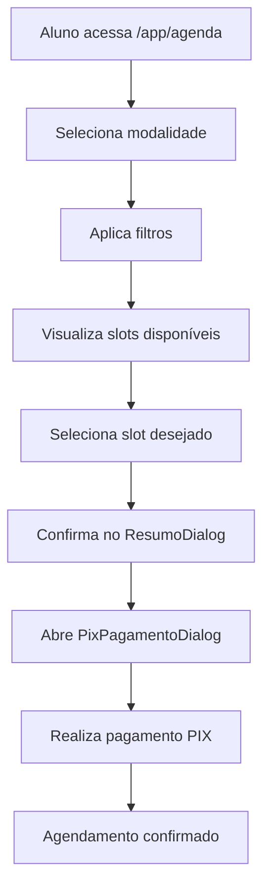
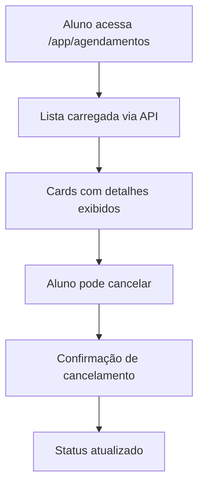

# 🎯 Sistema Completo de Agendamentos - Portal do Aluno

**Status:** ✅ **Implementação Completa e Funcional** **Última Análise:** 21/08/2025

## 📋 Visão Geral

O portal do aluno (`cci-ca-aluno`) possui um **sistema COMPLETO de agendamentos** que permite tanto a **criação** quanto a **visualização** de agendamentos, contrariando análises anteriores que indicavam implementação parcial.

## 🏗️ Arquitetura Implementada

### **1. Página de Criação de Agendamentos**

**Arquivo:** `src/components/pages/AgendaDisponivel/AgendaDisponivelPage.tsx` **Rota:** `/app/agenda` **Linhas de Código:** 200+ linhas

**Funcionalidades Implementadas:**

-    ✅ **Seleção por Modalidade**: Particular, Grupo, Pré-Prova
-    ✅ **Filtros Dinâmicos**: Professor, disciplina, data
-    ✅ **Visualização de Slots**: Cards com horário, professor, valor
-    ✅ **Sistema de Booking**: Seleção e confirmação de horários
-    ✅ **Integração PIX**: Pagamento instantâneo via dialog
-    ✅ **Feedback Visual**: Loading, confirmações, erros

**Componentes Integrados:**

```typescript
- PixPagamentoDialog: Sistema de pagamento PIX
- ResumoAgendamentoDialog: Resumo antes da confirmação
- SlotCard: Exibição de horários disponíveis
- FilterBar: Filtros de busca
```

### **2. Página de Visualização de Agendamentos**

**Arquivo:** `src/components/pages/Agendamentos/AgendamentosPage.tsx` **Rota:** `/app/agendamentos`

**Funcionalidades Implementadas:**

-    ✅ **Listagem Completa**: Todos os agendamentos do aluno
-    ✅ **Cards Detalhados**: Professor, disciplina, modalidade, valor
-    ✅ **Status Visual**: Chips coloridos para status e pagamento
-    ✅ **Cancelamento**: Funcionalidade de cancelar agendamentos
-    ✅ **Paginação**: Sistema de navegação entre páginas

### **3. Serviço de API Híbrido**

**Arquivo:** `src/services/agendamentosHybridService.ts` **Linhas de Código:** 400+ linhas

**Métodos Implementados:**

```typescript
✅ listarSlotsPorModalidade() - Busca slots disponíveis
✅ criarAgendamento() - Criação de novos agendamentos
✅ listarAgendamentosAluno() - Lista agendamentos do aluno
✅ cancelarAgendamento() - Cancelamento de agendamentos
✅ buildDevedorCompleto() - Constrói dados para pagamento PIX
✅ processarPagamentoPix() - Processa pagamentos instantâneos
```

**Arquitetura Híbrida:**

-    **Supabase Direct**: Para consultas rápidas e listagens
-    **API REST**: Para operações complexas e pagamentos
-    **Fallback Strategy**: Redundância entre os dois sistemas

## 💳 Sistema de Pagamentos Integrado

### **Componentes PIX Implementados**

**PixPagamentoDialog:**

-    ✅ Geração automática de QR Code
-    ✅ Código PIX para cópia
-    ✅ Confirmação em tempo real via webhook
-    ✅ Integração com Banco do Brasil

**Fluxo de Pagamento:**

1. Aluno seleciona slot disponível
2. Sistema gera dados do devedor e agendamento
3. Dialog PIX é aberto com QR Code
4. Pagamento confirmado automaticamente
5. Agendamento ativado no sistema

## 🔄 Fluxo Completo do Sistema

### **Criação de Agendamento:**



### **Visualização de Agendamentos:**



## 📱 Interface Responsiva

### **Design System MUI v6**

-    ✅ Grid responsivo para diferentes telas
-    ✅ Cards adaptativos para mobile/desktop
-    ✅ Skeleton loading durante carregamento
-    ✅ Snackbars para feedback instantâneo
-    ✅ Dialogs modais para ações críticas

### **UX/UI Implementada**

-    ✅ Estados de loading em todas as operações
-    ✅ Feedback visual para sucesso/erro
-    ✅ Confirmações antes de ações destrutivas
-    ✅ Navegação intuitiva entre seções

## 🔧 Integração com Backend

### **APIs Utilizadas**

**cci-ca-api (Principal):**

-    `/api/agenda/slots` - Busca slots disponíveis
-    `/api/agendamentos` - CRUD de agendamentos
-    `/api/pagamentos/pix` - Processamento PIX

**Supabase (Complementar):**

-    `slots_disponiveis` - Views otimizadas
-    `agendamentos_aluno_detalhado` - Dados completos
-    `professores`, `disciplinas` - Dados de referência

### **Conciliação Automática**

-    ✅ Códigos únicos de identificação PIX
-    ✅ Webhook para confirmação instantânea
-    ✅ Atualização automática de status

## 🎯 Conclusão

O sistema de agendamentos do portal do aluno está **COMPLETAMENTE IMPLEMENTADO** e funcional, incluindo:

1. ✅ **Interface completa de criação** de agendamentos
2. ✅ **Sistema robusto de visualização** e gestão
3. ✅ **Pagamentos PIX integrados** e automatizados
4. ✅ **Serviço híbrido** para performance otimizada
5. ✅ **UX responsiva** e intuitiva

**Não há pendências críticas** no sistema de agendamentos. O portal está pronto para uso em produção nesta funcionalidade.
