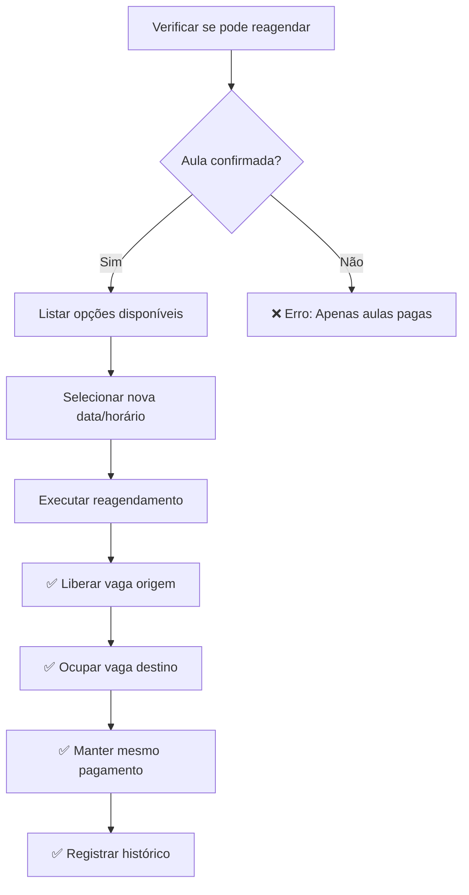

# 🔄 Sistema de Reagendamento - Guia Completo

**Versão:** 1.0  
**Status:** ✅ Operacional  
**Última Atualização:** 21/08/2025

## 📋 Visão Geral

O Sistema de Reagendamento permite remarcar **aulas já pagas via PIX** mantendo o mesmo pagamento quando há necessidade por motivos justificados.

### **✅ Vantagens do Sistema:**

-    **Manutenção do Pagamento**: Mesmo PIX, nova data
-    **Gestão Automática**: Libera/ocupa vagas automaticamente
-    **Auditoria Completa**: Registra motivos e histórico
-    **Zero Intervenção Manual**: Processo 100% automatizado

## 🔧 API Endpoints

### **1. Reagendar Aula**

```http
POST /api/reagendamento/reagendar
Content-Type: application/json

{
  "agendamentoId": 2,
  "novaData": "2025-08-20",
  "novoHorario": {
    "inicio": "16:00:00",
    "fim": "17:00:00"
  },
  "motivo": "doenca",
  "observacoes": "Aluno com gripe"
}
```

### **2. Listar Opções Disponíveis**

```http
GET /api/reagendamento/opcoes/1?dataInicio=2025-08-15&dataFim=2025-08-25
```

### **3. Histórico de Reagendamentos**

```http
GET /api/reagendamento/historico/2
```

### **4. Detalhes do Agendamento**

```http
GET /api/reagendamento/agendamento/2
```

## 🎯 Regras de Negócio

### **Validações Obrigatórias:**

1. ✅ **Status Permitido**: Apenas aulas `'confirmado'` (pagas)
2. ✅ **Data Futura**: Não permite reagendar aulas passadas
3. ✅ **Nova Data Válida**: Nova data não pode ser no passado
4. ✅ **Disponibilidade**: Professor deve ter horário disponível
5. ✅ **Vagas**: Deve existir vaga disponível no novo horário

### **Motivos Aceitos:**

| Código                | Descrição | Quando Usar                                |
| --------------------- | --------- | ------------------------------------------ |
| `doenca`              | Doença    | Aluno impossibilitado por motivos de saúde |
| `feriado`             | Feriado   | Suspensão por feriado municipal/nacional   |
| `reagendamento_comum` | Outros    | Demais necessidades de remarcação          |

## 🔄 Fluxo de Reagendamento



## 💻 Exemplos Práticos

### **Exemplo 1: Reagendamento por Doença**

```javascript
const reagendarPorDoenca = async (agendamentoId, novaData, novoHorario) => {
     const response = await fetch('/api/reagendamento/reagendar', {
          method: 'POST',
          headers: {
               'Content-Type': 'application/json',
          },
          body: JSON.stringify({
               agendamentoId,
               novaData,
               novoHorario,
               motivo: 'doenca',
               observacoes: 'Aluno impossibilitado por motivos de saúde',
          }),
     });

     const result = await response.json();
     console.log('Reagendamento:', result);
};

// Uso
reagendarPorDoenca(2, '2025-08-20', {
     inicio: '16:00:00',
     fim: '17:00:00',
});
```

### **Exemplo 2: Reagendamento por Feriado**

```bash
curl -X POST http://localhost:3002/api/reagendamento/reagendar \
  -H "Content-Type: application/json" \
  -d '{
    "agendamentoId": 3,
    "novaData": "2025-08-21",
    "novoHorario": {
      "inicio": "14:00:00",
      "fim": "15:30:00"
    },
    "motivo": "feriado",
    "observacoes": "Suspensão por feriado municipal"
  }'
```

### **Exemplo 3: Interface React**

```jsx
import React, { useState } from 'react';

const ReagendamentoForm = ({ agendamentoId }) => {
     const [novaData, setNovaData] = useState('');
     const [novoHorario, setNovoHorario] = useState({ inicio: '', fim: '' });
     const [motivo, setMotivo] = useState('doenca');
     const [observacoes, setObservacoes] = useState('');

     const handleReagendar = async () => {
          try {
               const response = await fetch('/api/reagendamento/reagendar', {
                    method: 'POST',
                    headers: { 'Content-Type': 'application/json' },
                    body: JSON.stringify({
                         agendamentoId,
                         novaData,
                         novoHorario,
                         motivo,
                         observacoes,
                    }),
               });

               const result = await response.json();

               if (result.success) {
                    alert('Reagendamento realizado com sucesso!');
               } else {
                    alert(`Erro: ${result.message}`);
               }
          } catch (error) {
               alert('Erro na comunicação com o servidor');
          }
     };

     return (
          <div>
               <h3>Reagendar Aula</h3>

               <input
                    type='date'
                    value={novaData}
                    onChange={(e) => setNovaData(e.target.value)}
                    placeholder='Nova data'
               />

               <input
                    type='time'
                    value={novoHorario.inicio}
                    onChange={(e) => setNovoHorario({ ...novoHorario, inicio: e.target.value })}
                    placeholder='Horário início'
               />

               <input
                    type='time'
                    value={novoHorario.fim}
                    onChange={(e) => setNovoHorario({ ...novoHorario, fim: e.target.value })}
                    placeholder='Horário fim'
               />

               <select
                    value={motivo}
                    onChange={(e) => setMotivo(e.target.value)}
               >
                    <option value='doenca'>Doença</option>
                    <option value='feriado'>Feriado</option>
                    <option value='reagendamento_comum'>Outros</option>
               </select>

               <textarea
                    value={observacoes}
                    onChange={(e) => setObservacoes(e.target.value)}
                    placeholder='Observações'
               />

               <button onClick={handleReagendar}>Reagendar</button>
          </div>
     );
};
```

## ⚠️ Tratamento de Erros

### **Erros Comuns:**

#### **1. "Apenas aulas confirmadas podem ser reagendadas"**

```json
{
     "success": false,
     "message": "Apenas aulas confirmadas (pagas) podem ser reagendadas"
}
```

**Solução**: Verificar se aula está com status `'confirmado'`

#### **2. "Horário não disponível"**

```json
{
     "success": false,
     "message": "Horário não disponível: Não há vagas disponíveis"
}
```

**Solução**: Usar `/opcoes/:professorId` para ver horários disponíveis

#### **3. "Data não pode ser no passado"**

```json
{
     "success": false,
     "message": "Nova data não pode ser no passado"
}
```

**Solução**: Escolher data futura

### **Tratamento no Frontend:**

```javascript
const handleReagendamento = async (dados) => {
     try {
          const response = await fetch('/api/reagendamento/reagendar', {
               method: 'POST',
               headers: { 'Content-Type': 'application/json' },
               body: JSON.stringify(dados),
          });

          const result = await response.json();

          if (!result.success) {
               // Tratar erros específicos
               switch (result.message) {
                    case 'Apenas aulas confirmadas (pagas) podem ser reagendadas':
                         alert('Esta aula não pode ser reagendada pois não foi paga ainda.');
                         break;
                    case 'Horário não disponível: Não há vagas disponíveis':
                         alert('O horário selecionado não está disponível. Escolha outro.');
                         break;
                    default:
                         alert(`Erro: ${result.message}`);
               }
               return;
          }

          // Sucesso
          alert('Aula reagendada com sucesso!');
     } catch (error) {
          alert('Erro de comunicação com o servidor.');
          console.error('Erro:', error);
     }
};
```

## 🎯 Casos de Uso Avançados

### **1. Reagendamento em Lote (Feriado)**

```javascript
// Reagendar múltiplas aulas por feriado
const reagendarPorFeriado = async (agendamentos, novaDataBase) => {
     const resultados = [];

     for (const agendamento of agendamentos) {
          try {
               const response = await fetch('/api/reagendamento/reagendar', {
                    method: 'POST',
                    headers: { 'Content-Type': 'application/json' },
                    body: JSON.stringify({
                         agendamentoId: agendamento.id,
                         novaData: novaDataBase,
                         novoHorario: agendamento.horario,
                         motivo: 'feriado',
                         observacoes: 'Reagendamento em lote por feriado',
                    }),
               });

               const result = await response.json();
               resultados.push({ id: agendamento.id, success: result.success });
          } catch (error) {
               resultados.push({ id: agendamento.id, success: false, error });
          }
     }

     return resultados;
};
```

### **2. Validação Antes do Reagendamento**

```javascript
const validarAntesDereAgendar = async (agendamentoId) => {
     // 1. Verificar detalhes
     const detalhesResponse = await fetch(`/api/reagendamento/agendamento/${agendamentoId}`);
     const detalhes = await detalhesResponse.json();

     if (!detalhes.data.podeReagendar) {
          throw new Error('Esta aula não pode ser reagendada');
     }

     // 2. Buscar opções disponíveis
     const professorId = detalhes.data.fkIdProfessor;
     const dataInicio = new Date().toISOString().split('T')[0];
     const dataFim = new Date(Date.now() + 30 * 24 * 60 * 60 * 1000).toISOString().split('T')[0];

     const opcoesResponse = await fetch(`/api/reagendamento/opcoes/${professorId}?dataInicio=${dataInicio}&dataFim=${dataFim}`);
     const opcoes = await opcoesResponse.json();

     return { detalhes, opcoes };
};
```

## 🏆 Boas Práticas

### **1. Sempre Validar Antes**

```javascript
// ✅ BOM: Validar antes de reagendar
const detalhes = await validarAntesDereAgendar(agendamentoId);
if (detalhes.opcoes.data.length === 0) {
     alert('Não há horários disponíveis para reagendamento');
     return;
}

// ❌ RUIM: Reagendar sem validar
await reagendar(dados); // Pode dar erro
```

### **2. Feedback ao Usuário**

```javascript
// ✅ BOM: Feedback em todas as etapas
setLoading(true);
try {
     const result = await reagendar(dados);
     setLoading(false);
     showSuccess('Aula reagendada com sucesso!');
} catch (error) {
     setLoading(false);
     showError(`Erro: ${error.message}`);
}
```

### **3. Histórico de Mudanças**

```javascript
// ✅ BOM: Registrar todas as mudanças
const historico = await fetch(`/api/reagendamento/historico/${alunoId}`);
console.log('Histórico de reagendamentos:', historico.data);
```

---

**Conclusão**: O sistema de reagendamento é robusto e automatizado, mantendo a integridade dos pagamentos PIX enquanto oferece flexibilidade para remarcar aulas quando necessário.
