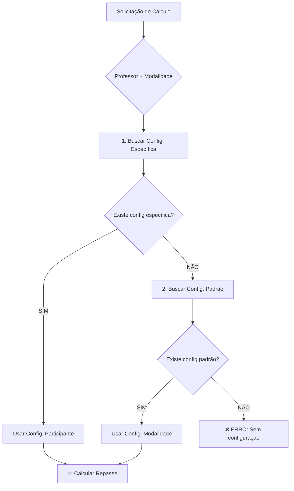

# 🔄 Fluxo Completo do Sistema de Configuração de Taxas

**Data:** 10 de setembro de 2025  
**Versão:** CCI-CA API v2.1

---

## 🏗️ Arquitetura das Duas Tabelas

### 📊 **Tabela 1: `configuracao_taxas_modalidade` (Configurações Padrão)**

```sql
configuracao_taxas_modalidade
├── id (PK)
├── fk_id_modalidade_aula       -- Referência à modalidade_aula
├── pix_tipo                    -- 'Percentual' | 'Fixo'
├── pix_valor                   -- Valor/Percentual para PIX
├── boleto_tipo                 -- 'Percentual' | 'Fixo'
├── boleto_valor                -- Valor/Percentual para BOLETO
├── ativo (boolean)
├── created_at, updated_at
└── created_by, updated_by, deleted_at, deleted_by
```

**Propósito:** Define as **configurações padrão** que se aplicam a todos os professores de uma modalidade.

### 👥 **Tabela 2: `configuracao_taxas_participante` (Configurações Específicas)**

```sql
configuracao_taxas_participante
├── id (PK)
├── fk_id_pessoa                -- Referência ao professor/participante
├── fk_id_modalidade_aula       -- Referência à modalidade_aula
├── pix_tipo                    -- 'Percentual' | 'Fixo' (pode ser NULL)
├── pix_valor                   -- Valor/Percentual para PIX (pode ser NULL)
├── boleto_tipo                 -- 'Percentual' | 'Fixo' (pode ser NULL)
├── boleto_valor                -- Valor/Percentual para BOLETO (pode ser NULL)
├── observacoes                 -- Comentários sobre a configuração
├── data_inicio                 -- Data de início da vigência
├── data_fim                    -- Data de fim da vigência (opcional)
├── ativo (boolean)
├── created_at, updated_at
└── created_by, updated_by, deleted_at, deleted_by
```

**Propósito:** Define **configurações específicas** que sobrepõem as configurações padrão para professores/participantes específicos.

---

## 🔄 Fluxo de Priorização (Hierárquico)

### 🎯 **Sistema de Busca com Priorização**



### 🔍 **Função SQL: `buscar_configuracao_taxa()`**

```sql
CREATE OR REPLACE FUNCTION buscar_configuracao_taxa(
    p_id_pessoa BIGINT,           -- ID do professor (pode ser NULL)
    p_id_modalidade_aula INTEGER, -- ID da modalidade
    p_data_referencia DATE        -- Data para verificar vigência
) RETURNS TABLE (
    fonte VARCHAR(50),            -- 'participante' ou 'modalidade'
    pix_tipo VARCHAR,
    pix_valor NUMERIC,
    boleto_tipo VARCHAR,
    boleto_valor NUMERIC,
    observacoes TEXT
) AS $$
```

**Lógica:**

1. **🎯 Primeira Prioridade**: Busca configuração específica do participante
     - Verifica se está dentro do período de vigência (`data_inicio` ≤ hoje ≤ `data_fim`)
     - Verifica se está ativa e não deletada
2. **📋 Segunda Prioridade**: Se não encontrar, busca configuração padrão da modalidade
3. **❌ Fallback**: Se não encontrar nenhuma, retorna erro

---

## 💡 Casos de Uso Práticos

### 📚 **Caso 1: Professor Normal (Usa Configuração Padrão)**

**Cenário:** Professor João agenda uma Aula Particular

```sql
-- Dados:
-- Professor ID: 123
-- Modalidade: Aula Particular (ID: 1)
-- Não possui configuração específica

-- Query executada:
SELECT * FROM buscar_configuracao_taxa(123, 1, CURRENT_DATE);

-- Resultado:
fonte: 'modalidade'
pix_tipo: 'Percentual', pix_valor: 85.00
boleto_tipo: 'Percentual', boleto_valor: 90.00
observacoes: 'Configuração padrão da modalidade'
```

**Cálculo do Repasse (PIX, R$ 100):**

-    Professor: 85% = R$ 85,00
-    Convênio: 15% = R$ 15,00

### 🌟 **Caso 2: Professor VIP (Configuração Específica)**

**Cenário:** Professor Maria (VIP) tem taxa especial para Aula Particular

```sql
-- Configuração específica cadastrada:
INSERT INTO configuracao_taxas_participante VALUES (
    DEFAULT, 456, 1, 'Percentual', 95.00, 'Percentual', 97.00,
    'Professor VIP - Taxa especial', '2025-01-01', NULL, true, ...
);

-- Query executada:
SELECT * FROM buscar_configuracao_taxa(456, 1, CURRENT_DATE);

-- Resultado:
fonte: 'participante'
pix_tipo: 'Percentual', pix_valor: 95.00
boleto_tipo: 'Percentual', boleto_valor: 97.00
observacoes: 'Professor VIP - Taxa especial'
```

**Cálculo do Repasse (PIX, R$ 100):**

-    Professor: 95% = R$ 95,00
-    Convênio: 5% = R$ 5,00

### 🎁 **Caso 3: Promoção Temporária**

**Cenário:** Professor Carlos tem taxa promocional por 3 meses

```sql
-- Configuração temporária:
INSERT INTO configuracao_taxas_participante VALUES (
    DEFAULT, 789, 1, 'Percentual', 90.00, 'Percentual', 92.00,
    'Promoção trimestral', '2025-01-01', '2025-03-31', true, ...
);

-- Durante o período (janeiro-março):
SELECT * FROM buscar_configuracao_taxa(789, 1, '2025-02-15');
-- Retorna: configuração promocional

-- Após o período (abril em diante):
SELECT * FROM buscar_configuracao_taxa(789, 1, '2025-04-01');
-- Retorna: configuração padrão da modalidade
```

---

## 🚀 Implementação no Código

### 📱 **RepasseCalculatorService.ts**

```typescript
// Método principal que usa o sistema de priorização
private async buscarConfiguracaoTaxa(
    modalidade: ModalidadeServico,
    professorId?: number
): Promise<ConfiguracaoTaxaModalidade> {
    try {
        const modalidadeId = MODALIDADE_IDS[modalidade];

        // Usa função SQL com priorização automática
        const { data, error } = await supabase
            .rpc('buscar_configuracao_taxa', {
                p_id_pessoa: professorId || null,
                p_id_modalidade_aula: modalidadeId,
                p_data_referencia: new Date().toISOString().split('T')[0]
            });

        if (!data || data.length === 0) {
            throw new Error(`Configuração não encontrada para modalidade ${modalidade}`);
        }

        const config = data[0];
        return {
            pix: {
                tipo: config.pix_tipo as 'Percentual' | 'Fixo',
                valor: parseFloat(config.pix_valor)
            },
            boleto: {
                tipo: config.boleto_tipo as 'Percentual' | 'Fixo',
                valor: parseFloat(config.boleto_valor)
            }
        };
    } catch (error) {
        // Fallback para configuração básica
        return {
            pix: { tipo: 'Percentual', valor: 1.0 },
            boleto: { tipo: 'Percentual', valor: 2.0 }
        };
    }
}
```

### 🎯 **Fluxo de Execução Completo**

```typescript
// 1. Chamada principal
const repasse = await service.calcularRepasseAula(
    100,                    // R$ 100,00
    'PIX',                  // Tipo de pagamento
    'Aula Particular',      // Nome da modalidade
    123                     // ID do professor
);

// 2. Busca configuração (com priorização automática)
const config = await this.buscarConfiguracaoTaxa('AULA_PARTICULAR', 123);

// 3. Validação
this.validarConfiguracaoRepasse(config, 100);

// 4. Cálculo baseado no tipo
if (config.pix.tipo === 'Fixo') {
    // Professor recebe valor fixo exato
    valorParticipante = config.pix.valor;
    valorConvenio = valorTotal - valorParticipante;
} else {
    // Professor recebe percentual, convênio recebe complemento
    valorParticipante = (valorTotal * config.pix.valor) / 100;
    valorConvenio = valorTotal - valorParticipante;
}

// 5. Resultado final
return {
    tipoValorRepasse: config.pix.tipo,
    recebedores: [
        { identificadorRecebedor: "125530", tipoRecebedor: "Convenio", valorRepasse: ... },
        { identificadorRecebedor: "123", tipoRecebedor: "Participante", valorRepasse: ... }
    ]
};
```

---

## 🎛️ Interface Administrativa

### 📋 **Gestão de Configurações Padrão**

```http
# Listar configurações padrão
GET /api/configuracao-taxas/modalidades

# Atualizar configuração padrão
PUT /api/configuracao-taxas/modalidade/1
{
  "pix_tipo": "Percentual",
  "pix_valor": 85.00,
  "boleto_tipo": "Percentual",
  "boleto_valor": 90.00
}
```

### 👥 **Gestão de Configurações Específicas**

```http
# Criar configuração específica para professor
POST /api/configuracao-taxas/participante
{
  "fk_id_pessoa": 456,
  "fk_id_modalidade_aula": 1,
  "pix_tipo": "Percentual",
  "pix_valor": 95.00,
  "boleto_tipo": "Percentual",
  "boleto_valor": 97.00,
  "observacoes": "Professor VIP",
  "data_inicio": "2025-01-01",
  "data_fim": null
}

# Consultar configuração efetiva (com priorização)
GET /api/configuracao-taxas/efetiva/456/1
```

---

## 📊 Vantagens do Sistema Duplo

### ✅ **Flexibilidade Total**

-    **Configurações globais** para facilitar gestão em massa
-    **Configurações específicas** para casos especiais
-    **Vigência temporal** para promoções e contratos

### ✅ **Escalabilidade**

-    Novos professores herdam automaticamente configurações padrão
-    Configurações específicas só quando necessário
-    Performance otimizada com busca priorizada

### ✅ **Auditoria Completa**

-    Histórico de todas as alterações (`created_by`, `updated_by`)
-    Soft delete para manter histórico (`deleted_at`)
-    Rastreabilidade completa das configurações

### ✅ **Facilidade de Manutenção**

-    Alteração em massa via configurações padrão
-    Exceções pontuais via configurações específicas
-    Sistema de fallback robusto

---

## 🎯 Resumo do Fluxo

1. **📋 Configuração Inicial**: Admin define taxas padrão por modalidade
2. **👥 Exceções Pontuais**: Admin cria configurações específicas quando necessário
3. **🔍 Busca Automática**: Sistema usa função SQL com priorização
4. **💰 Cálculo Preciso**: Aplica regras de valor fixo ou percentual
5. **✅ Resultado Consistente**: Garante exatidão e soma 100%

**O sistema combina simplicidade administrativa com flexibilidade total! 🚀**

---

_Documentação técnica completa - CCI-CA API v2.1_
