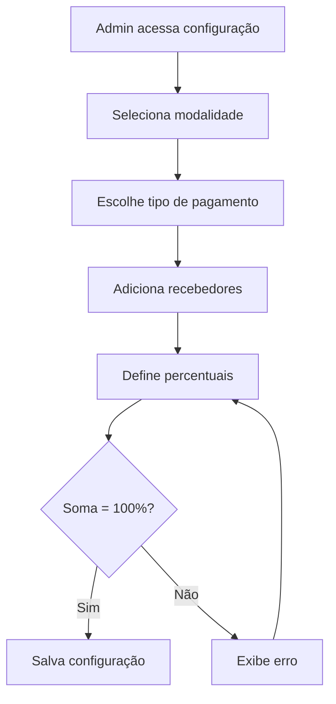
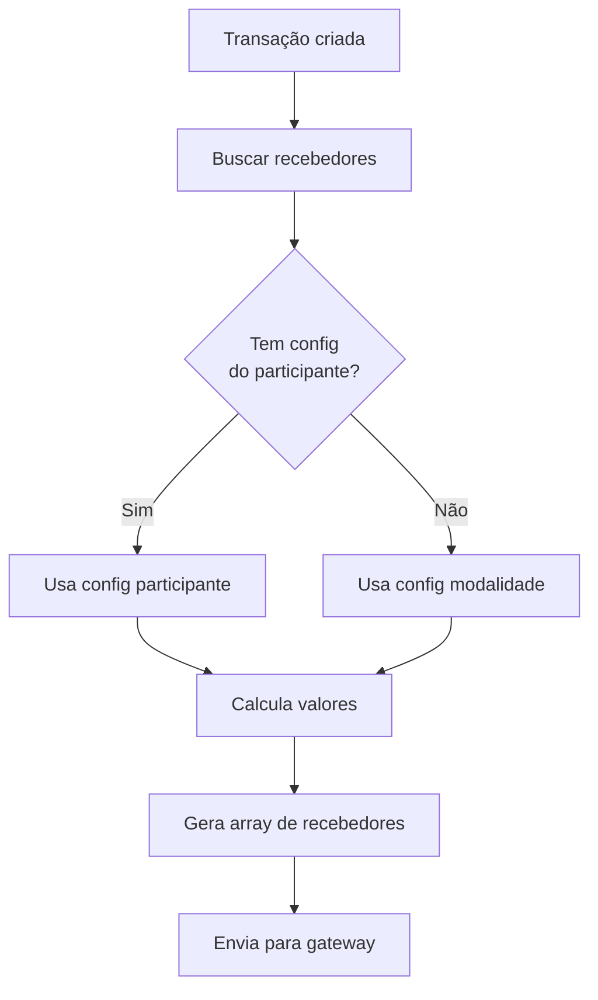

# 🔄 Sistema de Múltiplos Recebedores - Implementação Completa

**Data**: 13 de outubro de 2025  
**Versão**: 2.0  
**Status**: ✅ **IMPLEMENTADO**

---

## 🎯 Objetivo

Implementar sistema de **múltiplos recebedores** no CCI-CA, permitindo configurar **N pessoas** para receber valores de uma transação, ao invés de apenas 2 (Convênio + Professor).

---

## 📋 Requisitos Atendidos

### ✅ Requisitos Funcionais

-    [x] Permitir adicionar N recebedores por configuração
-    [x] Suportar diferentes tipos de recebedores (Convênio, Participante, Terceiro)
-    [x] Configurar percentual ou valor fixo para cada recebedor
-    [x] Validar que soma de percentuais = 100%
-    [x] Manter histórico de alterações
-    [x] Suportar configuração por modalidade (padrão)
-    [x] Suportar configuração específica por participante
-    [x] Priorização: Participante > Modalidade

### ✅ Requisitos Técnicos

-    [x] Migration do banco de dados
-    [x] Nova tabela `configuracao_recebedores`
-    [x] Função SQL para buscar recebedores com priorização
-    [x] Trigger para validar soma de percentuais
-    [x] Service na API para gerenciar recebedores
-    [x] Controller com endpoints RESTful
-    [x] Integração com RepasseCalculatorService
-    [x] Retrocompatibilidade com sistema anterior

---

## 🗄️ Estrutura do Banco de Dados

### Tabela: `configuracao_recebedores`

```sql
CREATE TABLE configuracao_recebedores (
    id SERIAL PRIMARY KEY,

    -- Relacionamento (um dos dois deve estar preenchido)
    fk_id_configuracao_modalidade INTEGER REFERENCES configuracao_taxas_modalidade(id),
    fk_id_configuracao_participante INTEGER REFERENCES configuracao_taxas_participante(id),

    -- Dados do recebedor
    identificador_recebedor VARCHAR(50) NOT NULL,
    tipo_recebedor VARCHAR(20) NOT NULL CHECK (tipo_recebedor IN ('Convenio', 'Participante', 'Terceiro')),
    tipo_pagamento VARCHAR(10) NOT NULL CHECK (tipo_pagamento IN ('PIX', 'BOLETO')),

    -- Tipo de valor
    tipo_valor VARCHAR(15) NOT NULL CHECK (tipo_valor IN ('Percentual', 'Fixo')),
    valor DECIMAL(10,2) NOT NULL,

    -- Controles
    ordem INTEGER NOT NULL DEFAULT 0,
    descricao VARCHAR(255),
    ativo BOOLEAN DEFAULT true,

    -- Auditoria
    created_at TIMESTAMP DEFAULT CURRENT_TIMESTAMP,
    updated_at TIMESTAMP DEFAULT CURRENT_TIMESTAMP,
    created_by INTEGER,
    updated_by INTEGER,
    deleted_at TIMESTAMP,
    deleted_by INTEGER,

    -- Constraints
    CONSTRAINT check_apenas_uma_configuracao CHECK (
        (fk_id_configuracao_modalidade IS NOT NULL AND fk_id_configuracao_participante IS NULL) OR
        (fk_id_configuracao_modalidade IS NULL AND fk_id_configuracao_participante IS NOT NULL)
    ),
    CONSTRAINT check_valor_positivo CHECK (valor > 0),
    CONSTRAINT check_percentual_valido CHECK (
        tipo_valor != 'Percentual' OR (valor >= 0 AND valor <= 100)
    )
);
```

### Função: `buscar_recebedores_configuracao`

Busca recebedores com priorização automática:

1. **Prioridade 1**: Configuração específica do participante
2. **Prioridade 2**: Configuração padrão da modalidade

```sql
SELECT * FROM buscar_recebedores_configuracao(
    p_id_modalidade_aula := 1,    -- ID da modalidade
    p_id_pessoa := 123,            -- ID da pessoa (opcional)
    p_tipo_pagamento := 'PIX'      -- PIX ou BOLETO
);
```

### Trigger: `validar_soma_percentuais`

Valida automaticamente que a soma dos percentuais não excede 100%.

---

## 🚀 API Endpoints

### **Listar Recebedores**

#### Recebedores de Modalidade (Padrão)

```http
GET /api/configuracao-taxas/recebedores/modalidade/:modalidadeId?tipoPagamento=PIX
```

**Response:**

```json
{
     "success": true,
     "data": [
          {
               "id": 1,
               "identificador_recebedor": "125530",
               "tipo_recebedor": "Convenio",
               "tipo_pagamento": "PIX",
               "tipo_valor": "Percentual",
               "valor": 20.0,
               "ordem": 1,
               "descricao": "Convênio CCI-CA"
          },
          {
               "id": 2,
               "identificador_recebedor": "DINAMICO",
               "tipo_recebedor": "Participante",
               "tipo_pagamento": "PIX",
               "tipo_valor": "Percentual",
               "valor": 70.0,
               "ordem": 2,
               "descricao": "Professor Principal"
          },
          {
               "id": 3,
               "identificador_recebedor": "456",
               "tipo_recebedor": "Terceiro",
               "tipo_pagamento": "PIX",
               "tipo_valor": "Percentual",
               "valor": 10.0,
               "ordem": 3,
               "descricao": "Professor Auxiliar"
          }
     ]
}
```

#### Recebedores de Participante Específico

```http
GET /api/configuracao-taxas/recebedores/participante/:pessoaId/:modalidadeId?tipoPagamento=PIX
```

#### Recebedores Efetivos (com Priorização)

```http
GET /api/configuracao-taxas/recebedores/efetivos/:modalidadeId?pessoaId=123&tipoPagamento=PIX
```

### **Atualizar Recebedores**

#### Atualizar Recebedores de Modalidade

```http
PUT /api/configuracao-taxas/recebedores/modalidade/:modalidadeId
Content-Type: application/json

{
  "tipoPagamento": "PIX",
  "recebedores": [
    {
      "identificador_recebedor": "125530",
      "tipo_recebedor": "Convenio",
      "tipo_pagamento": "PIX",
      "tipo_valor": "Percentual",
      "valor": 20,
      "ordem": 1,
      "descricao": "Convênio CCI-CA"
    },
    {
      "identificador_recebedor": "DINAMICO",
      "tipo_recebedor": "Participante",
      "tipo_pagamento": "PIX",
      "tipo_valor": "Percentual",
      "valor": 60,
      "ordem": 2,
      "descricao": "Professor 1"
    },
    {
      "identificador_recebedor": "789",
      "tipo_recebedor": "Terceiro",
      "tipo_pagamento": "PIX",
      "tipo_valor": "Percentual",
      "valor": 10,
      "ordem": 3,
      "descricao": "Professor 2"
    },
    {
      "identificador_recebedor": "999",
      "tipo_recebedor": "Terceiro",
      "tipo_pagamento": "PIX",
      "tipo_valor": "Percentual",
      "valor": 10,
      "ordem": 4,
      "descricao": "Outro recebedor"
    }
  ]
}
```

**Response:**

```json
{
     "success": true,
     "message": "Recebedores atualizados com sucesso"
}
```

#### Atualizar Recebedores de Participante

```http
PUT /api/configuracao-taxas/recebedores/participante/:pessoaId/:modalidadeId
```

### **Remover Recebedor**

```http
DELETE /api/configuracao-taxas/recebedores/:recebedorId
```

---

## 💻 Implementação na API

### Service: `RecebedoresConfigService`

```typescript
// Buscar recebedores efetivos (com priorização)
const recebedores = await RecebedoresConfigService.buscarRecebedoresEfetivos(
     modalidadeId,
     pessoaId,
     'PIX'
);

// Atualizar recebedores de modalidade
await RecebedoresConfigService.atualizarRecebedoresModalidade(
     modalidadeId,
     'PIX',
     [
          { identificador_recebedor: '125530', tipo_recebedor: 'Convenio', valor: 20, ... },
          { identificador_recebedor: 'DINAMICO', tipo_recebedor: 'Participante', valor: 60, ... },
          { identificador_recebedor: '789', tipo_recebedor: 'Terceiro', valor: 10, ... },
          { identificador_recebedor: '999', tipo_recebedor: 'Terceiro', valor: 10, ... }
     ],
     userId
);
```

### Service: `RepasseCalculatorService`

```typescript
// Cálculo com múltiplos recebedores (novo sistema)
const repasse = await repasseCalculator.calcularRepasseComMultiplosRecebedores({
     valorTotal: 150.00,
     tipoPagamento: 'PIX',
     modalidade: 'AULA_PARTICULAR',
     identificadorParticipante: '123',
     numeroConvenio: 125530
});

// Resultado:
{
     tipoValorRepasse: 'Percentual',
     recebedores: [
          { identificadorRecebedor: '125530', tipoRecebedor: 'Convenio', valorRepasse: 20.00 },
          { identificadorRecebedor: '123', tipoRecebedor: 'Participante', valorRepasse: 60.00 },
          { identificadorRecebedor: '789', tipoRecebedor: 'Participante', valorRepasse: 10.00 },
          { identificadorRecebedor: '999', tipoRecebedor: 'Participante', valorRepasse: 10.00 }
     ]
}
```

---

## 🔄 Fluxo Operacional

### 1. **Configuração Inicial**



### 2. **Cálculo de Repasse**



### 3. **Exemplo Prático**

**Cenário**: Aula de R$ 150,00 com 4 recebedores

**Configuração:**

-    Convênio: 20% = R$ 30,00
-    Professor 1: 60% = R$ 90,00
-    Professor 2: 10% = R$ 15,00
-    Outro: 10% = R$ 15,00

**Payload enviado para gateway:**

```json
{
     "valorTotal": 150.0,
     "repasse": {
          "tipoValorRepasse": "PERCENTUAL",
          "recebedores": [
               { "identificadorRecebedor": "125530", "tipoRecebedor": "CONVENIO", "valorRepasse": 20 },
               { "identificadorRecebedor": "123", "tipoRecebedor": "PARTICIPANTE", "valorRepasse": 60 },
               { "identificadorRecebedor": "789", "tipoRecebedor": "PARTICIPANTE", "valorRepasse": 10 },
               { "identificadorRecebedor": "999", "tipoRecebedor": "PARTICIPANTE", "valorRepasse": 10 }
          ]
     }
}
```

---

## ✅ Validações Implementadas

### 1. **Soma de Percentuais**

-    ✅ Validação no banco (trigger)
-    ✅ Validação na API (service)
-    ✅ Validação no frontend (em tempo real)

### 2. **Valores Fixos**

-    ✅ Soma dos fixos não pode exceder valor total
-    ✅ Todos os recebedores devem usar o mesmo tipo

### 3. **Consistência**

-    ✅ Todos os recebedores de uma configuração devem usar o mesmo tipo (Percentual ou Fixo)
-    ✅ Identificador_recebedor "DINAMICO" é substituído pelo ID do professor no momento do cálculo

---

## 🧪 Testes Sugeridos

### Teste 1: Configurar 4 Recebedores

```typescript
await atualizarRecebedoresModalidade(1, 'PIX', [
  { identificador: '125530', tipo: 'Convenio', valor: 20, ... },
  { identificador: 'DINAMICO', tipo: 'Participante', valor: 60, ... },
  { identificador: '789', tipo: 'Terceiro', valor: 10, ... },
  { identificador: '999', tipo: 'Terceiro', valor: 10, ... }
]);
```

### Teste 2: Validar Soma > 100%

```typescript
// Deve falhar
await atualizarRecebedoresModalidade(1, 'PIX', [
  { valor: 60, ... },
  { valor: 50, ... } // Total = 110%
]);
```

### Teste 3: Calcular Repasse

```typescript
const repasse = await calcularRepasseComMultiplosRecebedores({
     valorTotal: 200.0,
     tipoPagamento: 'PIX',
     modalidade: 'AULA_PARTICULAR',
     identificadorParticipante: '123',
});

// Deve retornar array com 4 recebedores
```

---

## 📊 Comparação: Antes vs Depois

| Aspecto           | Sistema Anterior                | Sistema Novo                    |
| ----------------- | ------------------------------- | ------------------------------- |
| **Recebedores**   | 2 fixos (Convênio + Professor)  | N recebedores dinâmicos         |
| **Configuração**  | Hardcoded ou 2 campos na tabela | Tabela dedicada com N registros |
| **Flexibilidade** | Baixa                           | Alta                            |
| **Validação**     | Manual                          | Automática (trigger + service)  |
| **Priorização**   | Não tinha                       | Participante > Modalidade       |
| **Histórico**     | Não                             | Soft delete com timestamps      |
| **Interface**     | 2 campos fixos                  | Lista dinâmica                  |

---

## 🔄 Retrocompatibilidade

O sistema novo mantém **retrocompatibilidade completa**:

1. **Migration automática** dos dados existentes
2. **Fallback** para sistema antigo se não houver recebedores configurados
3. **Método legado** `calcularRepasseComConfiguracao` mantido
4. **Estrutura de payload** compatível com gateway existente

---

## 📝 Próximos Passos

### Frontend (cci-ca-admin)

1. ✅ Interface para adicionar/remover recebedores
2. ✅ Busca de professores/participantes
3. ✅ Validação em tempo real da soma = 100%
4. ✅ Preview de divisão de valores
5. ✅ Histórico de alterações

### Melhorias Futuras

-    [ ] Dashboard com estatísticas de repasses por recebedor
-    [ ] Relatórios de histórico de configurações
-    [ ] Alertas quando soma != 100%
-    [ ] Simulador de cenários de repasse
-    [ ] Export de configurações em CSV/Excel

---

## 📞 Suporte

Para dúvidas ou problemas:

-    **Documentação**: `/docs/Financeiro/SISTEMA_MULTIPLOS_RECEBEDORES.md`
-    **API**: `/docs/Financeiro/API_MULTIPLOS_RECEBEDORES.md`
-    **Migration**: `/migrations/20251013_multiplos_recebedores.sql`

---

_Sistema implementado por Gabriel M. Guimarães - 13/10/2025_
