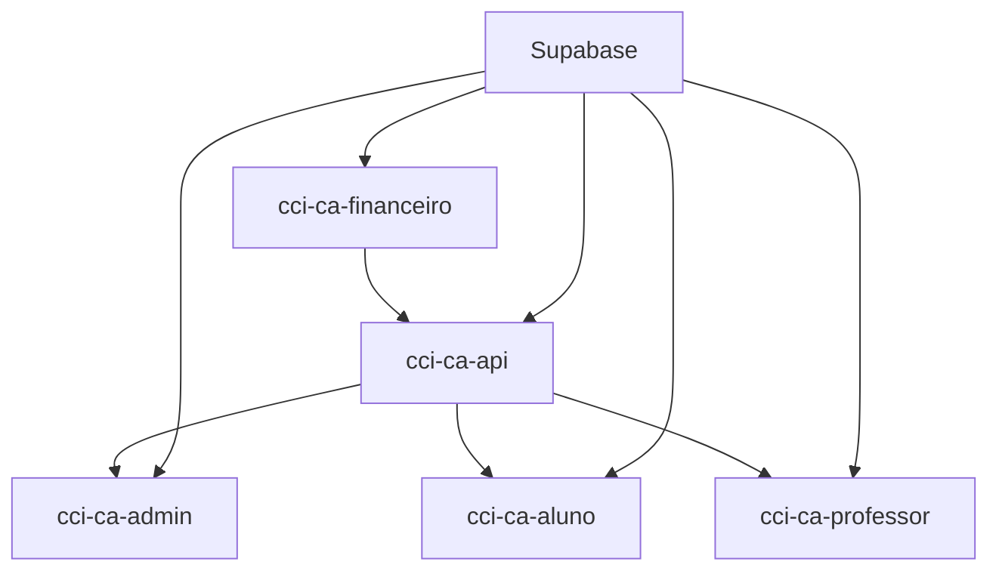

# 📊 Status Atual dos Projetos do Workspace CCI-CA

**Última Atualização**: 21 de agosto de 2025  
**Verificação**: Manual baseada em análise de código

## 🎯 Resumo Executivo

| Projeto           | Status             | Funcionalidades Principais                             | Observações                   |
| ----------------- | ------------------ | ------------------------------------------------------ | ----------------------------- |
| cci-ca-api        | ✅ **Completo**    | Pagamentos, Agendamentos, Agenda Diária, Reagendamento | Backend principal funcionando |
| cci-ca-admin      | ✅ **Operacional** | Sistema completo de agenda diária, CRUD administrativo | Interface admin completa      |
| cci-ca-aluno      | ✅ **Operacional** | Dashboard, visualização de agendamentos                | -                             |

## 🔍 Análise Detalhada por Projeto

### 🔧 **cci-ca-api** ✅ **COMPLETO**

**Tecnologias**: Node.js + TypeScript + Express + Supabase  
**Deploy**: Netlify Functions (serverless-http)  
**Porta Local**: 3002

**Módulos Implementados**:

-    ✅ **Pagamentos**: Solicitações PIX, webhooks, CRUD legado
-    ✅ **Agendamentos**: Configuração, slots, calendário, operações
-    ✅ **Agenda Diária**: Templates, exceções, geração automática, estatísticas
-    ✅ **Reagendamento**: Sistema completo para aulas pagas
-    ✅ **Admin Auth**: Criação de usuários Supabase

**Endpoints Ativos**: 30+ endpoints funcionando

### 🖥️ **cci-ca-admin** ✅ **OPERACIONAL**

**Tecnologias**: React 18 + TypeScript + MUI v5 + Supabase  
**Foco**: Interface administrativa completa

**Módulos Encontrados**:

-    ✅ **Sistema de Agenda Diária**: 7 componentes + hook de 679 linhas
     -    GerenciarAgendamentos.tsx
     -    TemplatesRecorrenciaModal, ExcecoesModal, EstatisticasModal
     -    GeracaoAutomaticaModal, TemplateFormModal, ExcecaoFormModal
-    ✅ **CRUD Administrativo**: Alunos, professores, disciplinas, turmas
-    ✅ **Relatórios**: Declarações, notas fiscais
-    ✅ **Gestão Acadêmica**: Contratos, pagamentos, avaliações

**Localização Sistema Agenda**: `src/components/pages/Academico/Aulas/Agendamentos/`

### 🎓 **cci-ca-aluno** ✅ **SISTEMA COMPLETO DE AGENDAMENTOS**

**Tecnologias**: React 19 + TypeScript + MUI v6 + Supabase

**Implementado**:

-    ✅ **Dashboard**: Cards de estatísticas, atalhos, próximas aulas
-    ✅ **Autenticação**: Login, cadastro inicial, contextos
-    ✅ **Sistema COMPLETO de Agendamentos**:
     -    ✅ Criação (`AgendaDisponivelPage`) - Interface completa
     -    ✅ Visualização (`AgendamentosPage`) - Lista com cancelamento
     -    ✅ Seleção por modalidade e professor
     -    ✅ Booking de slots com pagamento PIX
-    ✅ **Estrutura Base**: Layouts, temas, roteamento
-    ✅ **Pagamentos PIX**: Dialog integrado, QR Code, confirmação automática

**Para Desenvolvimento Futuro**:

-    🔄 **Módulo Financeiro**: Será recriado aqui (substituindo cci-ca-financeiro)
-    ⏳ **Perfil Completo**: Gestão de dados pessoais avançada

**Arquivos Principais Agendamentos**:

-    `src/components/pages/AgendaDisponivel/AgendaDisponivelPage.tsx` (Criação)
-    `src/components/pages/Agendamentos/AgendamentosPage.tsx` (Visualização)
-    `src/services/agendamentosHybridService.ts` (API Service)


## 🔄 Integrações e APIs

### **Comunicação Entre Projetos**



**URLs de Integração**:

-    API Principal: `https://cci-ca-api.netlify.app` (porta 3002 local)
-    Financeiro: Sistema separado com próprias APIs

## 🔧 Como Executar Cada Projeto

### **Backend (cci-ca-api)**

```powershell
cd cci-ca-api
npm install
npm run dev  # http://localhost:3002
```

### **Admin (cci-ca-admin)**

```powershell
cd cci-ca-admin
npm install
npm run dev  # http://localhost:5173
```

### **Aluno (cci-ca-aluno)**

```powershell
cd cci-ca-aluno
npm install
npm run dev  # http://localhost:5173
```


## 📊 Métricas de Código

| Projeto           | React Version | MUI Version | TypeScript | Status Implementação                   |
| ----------------- | ------------- | ----------- | ---------- | -------------------------------------- |
| cci-ca-api        | -             | -           | ✅         | ✅ **COMPLETO** - Todas as APIs        |
| cci-ca-admin      | 18.3.1        | 5.15.20     | ✅         | ✅ **COMPLETO** - Sistema agenda       |
| cci-ca-aluno      | 19.1.1        | 6.4.12      | ✅         | ✅ **AGENDAMENTOS COMPLETOS** + PIX    |

## 🎯 Status Final Corrigido

### **Projetos Prontos para Produção:**

-    ✅ **cci-ca-api**: Backend completo com todas as funcionalidades
-    ✅ **cci-ca-admin**: Interface administrativa completa
-    ✅ **cci-ca-aluno**: Sistema de agendamentos COMPLETO + PIX integrado


**Conclusão Corrigida**: O workspace possui 3 projetos completamente funcionais em produção. O portal do aluno tem sistema COMPLETO de agendamentos, contrariando análises anteriores. Apenas o portal do professor necessita desenvolvimento completo.
