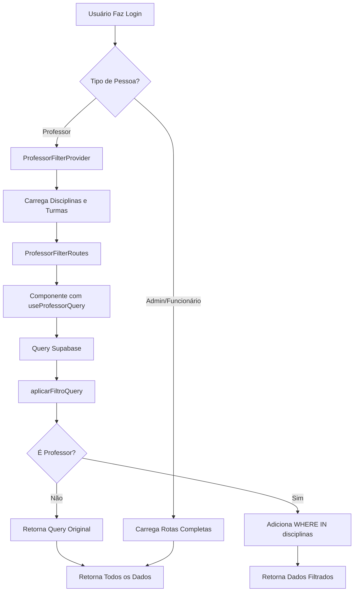

# 👨‍🏫 Módulo de Professores - CCI-CA Admin

**Última Atualização:** 07/10/2025  
**Status:** ✅ Sistema Operacional

## 📋 Resumo Executivo

O **Módulo de Professores** do Portal Administrativo CCI-CA implementa um sistema completo de controle de acesso e filtragem de dados para usuários do tipo Professor (`tipo_pessoa = 4`). O sistema garante que professores visualizem e gerenciem apenas dados relacionados às suas disciplinas e turmas,
mantendo a segurança e privacidade das informações.

---

## 🎯 Objetivo do Módulo

Permitir que professores acessem o sistema administrativo com **permissões restritas**, visualizando e gerenciando apenas:

-    ✅ **Agendamentos** de suas disciplinas
-    ✅ **Alunos matriculados** em suas turmas
-    ✅ **Espaços de aula** relacionados aos seus agendamentos
-    ✅ **Parcelas e contratos** de seus alunos (visualização apenas)

---

## 🏗️ Arquitetura do Sistema

### **Componentes Principais**

```
src/
├── contexts/
│   └── ProfessorFilterContext/
│       ├── ProfessorFilterContext.tsx    # Provider principal
│       ├── context.ts                    # Contexto React
│       ├── types.ts                      # Interfaces TypeScript
│       ├── useProfessorFilter.tsx        # Hook de acesso ao contexto
│       └── index.ts                      # Exports do módulo
├── hooks/
│   ├── useProfessorQuery.ts              # Hook para filtros em queries (COM contexto)
│   └── useConditionalProfessorQuery.ts   # Hook condicional (SEM contexto obrigatório)
└── routes/
    ├── UserRoutes.tsx                    # Roteamento condicional
    └── ProfessorFilterRoutes.tsx         # Rotas exclusivas para professores
```

---

## 🔑 Sistema de Autenticação e Controle de Sessão

### **1. Verificação de Tipo de Usuário**

O sistema identifica professores através do campo `fk_id_tipo_pessoa` na tabela `pessoas`:

```typescript
// UserRoutes.tsx
const isProfessor = userData?.fk_id_tipo_pessoa === 4;
```

**Tipos de Pessoa:**

-    `1`: Administrador (acesso completo)
-    `2`: Funcionário (acesso completo)
-    `4`: Professor (acesso filtrado)

### **2. Roteamento Condicional**

Baseado no tipo de usuário, o sistema redireciona para rotas diferentes:

```typescript
// UserRoutes.tsx
return (
     <UserLayout title=''>
          {isProfessor ? (
               // Rotas filtradas com provider
               <ProfessorFilterRoutes />
          ) : (
               // Rotas administrativas completas
               <Routes>
                    {UtilRoutes()}
                    {EstruturaRoutes()}
                    {AlunoRoutes()}
                    {ContratoRoutes()}
                    {MaterialRoutes()}
                    {ProfessorRoutes()}
                    {RelatorioRoutes()}
                    {AcademicoRoutes()}
               </Routes>
          )}
     </UserLayout>
);
```

---

## 📊 Sistema de Permissões e Filtros

### **ProfessorFilterContext - Provider Principal**

O contexto gerencia automaticamente as permissões do professor:

```typescript
// ProfessorFilterContext.tsx
export const ProfessorFilterProvider: React.FC<{ children: React.ReactNode }> = ({ children }) => {
     const { userData } = useUserContext();
     const [isProfessor, setIsProfessor] = useState(false);
     const [professorData, setProfessorData] = useState<ProfessorData | null>(null);
     const [disciplinasPermitidas, setDisciplinasPermitidas] = useState<number[]>([]);
     const [turmasPermitidas, setTurmasPermitidas] = useState<number[]>([]);

     // Verifica tipo_pessoa e carrega disciplinas/turmas automaticamente
     useEffect(() => {
          verificarTipoProfessor();
     }, [userData?.id]);

     // ... lógica de carregamento
};
```

**Dados Carregados Automaticamente:**

1. **Disciplinas do Professor:**

     ```sql
     SELECT id, nome FROM disciplinas
     WHERE fk_id_professor = {professor_id}
     AND deleted_at IS NULL
     ```

2. **Turmas das Disciplinas:**
     ```sql
     SELECT id, descricao FROM turmas
     WHERE fk_id_disciplina IN (disciplinas_do_professor)
     ```

### **Interface ProfessorFilterContextType**

```typescript
// types.ts
export interface ProfessorFilterContextType {
     isProfessor: boolean; // Flag de identificação
     professorData: ProfessorData | null; // Dados completos do professor
     disciplinasPermitidas: number[]; // IDs das disciplinas permitidas
     turmasPermitidas: number[]; // IDs das turmas permitidas
     loading: boolean; // Estado de carregamento
     error: string | null; // Erros de carregamento
}
```

---

## 🛠️ Hooks de Filtro de Queries

### **1. useProfessorQuery (Requer Contexto)**

Hook para aplicar filtros em queries Supabase **dentro de rotas com ProfessorFilterProvider**:

```typescript
// useProfessorQuery.ts
const { aplicarFiltroQuery, isProfessor } = useProfessorQuery({
     tabela: 'agendamentos',
});

// Uso em componente
let query = supabase.from('agendamentos_alunos').select('*');

query = aplicarFiltroQuery(query); // Aplica filtro automático

const { data } = await query;
```

**Filtros Disponíveis por Tabela:**

| Tabela                | Campo Filtrado     | Lógica de Filtro              |
| --------------------- | ------------------ | ----------------------------- |
| `agendamentos`        | `fk_id_disciplina` | IN (disciplinas_do_professor) |
| `disciplinas`         | `id`               | IN (disciplinas_do_professor) |
| `turmas`              | `fk_id_disciplina` | IN (disciplinas_do_professor) |
| `alunos_matriculados` | `fk_id_turma`      | IN (turmas_do_professor)      |

### **2. useConditionalProfessorQuery (Não Requer Contexto)**

Hook para componentes que podem estar **fora ou dentro** do ProfessorFilterProvider:

```typescript
// useConditionalProfessorQuery.ts
const { aplicarFiltroQuery, hasContext, isProfessor } = useConditionalProfessorQuery({
     tabela: 'agendamentos',
});

// Se não há contexto, comporta-se como administrador
// Se há contexto E é professor, aplica filtros
```

**Quando Usar Cada Hook:**

-    **useProfessorQuery**: Componentes dentro de `<ProfessorFilterRoutes />`
-    **useConditionalProfessorQuery**: Componentes reutilizados em múltiplas rotas

---

## 🗺️ Rotas Exclusivas para Professores

### **ProfessorFilterRoutes.tsx**

Rotas disponíveis apenas para usuários autenticados como professores:

```typescript
<ProfessorFilterProvider>
     <Routes>
          {/* Home do Professor */}
          <Route
               path='home'
               element={<HomeProfessor />}
          />

          {/* Agendamentos */}
          <Route
               path='academico/aulas/agendamentos'
               element={<GerenciarAgendamentos />}
          />
          <Route
               path='academico/aulas/agendamentos-confirmados'
               element={<AgendamentosConfirmados />}
          />
          <Route
               path='agendamentos'
               element={<AgendamentosAdminPage />}
          />
          <Route
               path='academico/aulas/agendamentos-temporarios'
               element={<AgendamentosAdminPage />}
          />

          {/* Espaços de Aula */}
          <Route
               path='academico/espacos-aula'
               element={<ListarEspacosAula />}
          />
          <Route
               path='academico/espacos-aula/criar'
               element={<ManterEspacoAula />}
          />
          <Route
               path='academico/espacos-aula/:id'
               element={<ManterEspacoAula />}
          />

          {/* Alunos e Parcelas */}
          <Route
               path='alunos-matriculados'
               element={<ListarAlunosProfessor />}
          />
          <Route
               path='manter-aluno/:id/ver'
               element={<ManterAluno />}
          />
          <Route
               path='manter-parcelas/:id'
               element={<ManterParcelas />}
          />
     </Routes>
</ProfessorFilterProvider>
```

### **Funcionalidades Disponíveis**

| Funcionalidade               | Permissão  | Componente                         |
| ---------------------------- | ---------- | ---------------------------------- |
| **Dashboard Home**           | ✅ Leitura | HomeProfessor                      |
| Ver agendamentos próprios    | ✅ Leitura | GerenciarAgendamentos              |
| Ver agendamentos confirmados | ✅ Leitura | AgendamentosConfirmados            |
| Gerenciar espaços de aula    | ✅ CRUD    | ListarEspacosAula                  |
| Ver alunos matriculados      | ✅ Leitura | ListarAlunosProfessor              |
| Ver dados de alunos          | ✅ Leitura | ManterAluno (modo somente leitura) |
| Ver parcelas de alunos       | ✅ Leitura | ManterParcelas                     |

### **🏠 HomeProfessor - Dashboard Personalizado**

Tela inicial para professores com visão completa e prática de suas atividades:

**Seções Principais:**

1. **📊 Cards de Estatísticas**

     - Aulas hoje (com link direto)
     - Aulas da semana atual
     - Total de alunos matriculados (com link direto)
     - Número de disciplinas

2. **📅 Aulas de Hoje**

     - Lista completa de agendamentos do dia
     - Informações: aluno, horário, disciplina, local
     - Status visual (confirmado, realizado)
     - Link para gerenciar agendamentos

3. **⏰ Próximas Aulas (7 dias)**

     - Próximos 5 agendamentos
     - Agrupamento por data (Hoje, Amanhã, dia da semana)
     - Visualização clara de status

4. **📚 Minhas Disciplinas**

     - Cards com todas as disciplinas do professor
     - Quantidade de turmas por disciplina
     - Visual organizado em grid responsivo

5. **🔗 Atalhos Rápidos**
     - Gerenciar Agendamentos
     - Meus Alunos
     - Espaços de Aula
     - Aulas Confirmadas

**Características Técnicas:**

-    ✅ Carregamento automático de dados via `useProfessorQuery`
-    ✅ Filtros aplicados automaticamente por disciplinas/turmas
-    ✅ Estados de loading com skeleton
-    ✅ Navegação integrada com React Router
-    ✅ Design responsivo (mobile-first)
-    ✅ Cores temáticas do Material-UI

---

## 🔒 Segurança e Validações

### **1. Filtros no Frontend**

```typescript
// Exemplo em GerenciarAgendamentos
const { aplicarFiltroQuery, temPermissao } = useProfessorQuery({ tabela: 'agendamentos' });

if (!temPermissao) {
     return <Alert severity='error'>Você não possui permissão para acessar esta página</Alert>;
}

let query = supabase.from('agendamentos_alunos').select('*');
query = aplicarFiltroQuery(query);
```

### **2. Validações no Backend (Supabase RLS)**

**Recomendações de RLS (Row Level Security):**

```sql
-- Política para professores em agendamentos_alunos
CREATE POLICY "professores_ver_seus_agendamentos"
ON agendamentos_alunos FOR SELECT
USING (
     fk_id_disciplina IN (
          SELECT id FROM disciplinas
          WHERE fk_id_professor = auth.uid()
     )
);

-- Política para professores em alunos_matriculados
CREATE POLICY "professores_ver_seus_alunos"
ON alunos_matriculados FOR SELECT
USING (
     fk_id_turma IN (
          SELECT t.id FROM turmas t
          JOIN disciplinas d ON t.fk_id_disciplina = d.id
          WHERE d.fk_id_professor = auth.uid()
     )
);
```

---

## 🎨 Exemplo Prático de Implementação

### **Cenário: Componente de Listagem de Agendamentos**

```typescript
// GerenciarAgendamentos.tsx
import { useProfessorQuery } from '../../hooks/useProfessorQuery';

const GerenciarAgendamentos = () => {
     const { aplicarFiltroQuery, isProfessor, disciplinasPermitidas, temPermissao } = useProfessorQuery({
          tabela: 'agendamentos',
     });

     useEffect(() => {
          carregarAgendamentos();
     }, []);

     const carregarAgendamentos = async () => {
          try {
               let query = supabase
                    .from('agendamentos_alunos')
                    .select(
                         `
                         *,
                         agendamento_professor(*),
                         agendamento_aluno(*)
                    `,
                    )
                    .order('data_agendamento', { ascending: false });

               // Aplica filtro automático se for professor
               query = aplicarFiltroQuery(query);

               const { data, error } = await query;

               if (error) throw error;
               setAgendamentos(data);

               console.log(isProfessor ? `📚 Carregados ${data.length} agendamentos das disciplinas: ${disciplinasPermitidas.join(', ')}` : `📚 Carregados ${data.length} agendamentos (admin - sem filtros)`);
          } catch (error) {
               console.error('Erro ao carregar agendamentos:', error);
          }
     };

     if (!temPermissao) {
          return <Alert severity='warning'>Você não possui disciplinas cadastradas. Contate o administrador.</Alert>;
     }

     return (
          <Container>
               {isProfessor && (
                    <Alert
                         severity='info'
                         sx={{ mb: 2 }}
                    >
                         Você está visualizando agendamentos das suas disciplinas: {disciplinasPermitidas.join(', ')}
                    </Alert>
               )}
               {/* Resto do componente */}
          </Container>
     );
};
```

---

## 📈 Fluxo Completo de Autenticação e Filtragem



---

## 🚀 Próximas Melhorias

### **Curto Prazo:**

-    ✅ Sistema já implementado e funcional
-    🔄 Implementar políticas RLS no Supabase para segurança adicional
-    🔄 Adicionar logs de auditoria para ações de professores

### **Médio Prazo:**

-    📋 Dashboard específico para professores com métricas
-    📋 Sistema de notificações para novos agendamentos
-    📋 Relatórios personalizados por professor

---

## 🔧 Configuração e Uso

### **1. Criar Usuário Professor**

```typescript
// Via Portal Admin
// 1. Acessar "Cadastro de Pessoas"
// 2. Selecionar tipo_pessoa = 4 (Professor)
// 3. Preencher dados cadastrais
// 4. Associar disciplinas em "Cadastro de Disciplinas"
```

### **2. Testar Filtros**

```typescript
// Console do navegador após login como professor
console.log('Disciplinas permitidas:', disciplinasPermitidas);
console.log('Turmas permitidas:', turmasPermitidas);
console.log('É professor?', isProfessor);
```

---

## 📚 Referências Técnicas

### **Contextos Relacionados:**

-    `UserContext`: Gerencia dados do usuário logado
-    `ProfessorFilterContext`: Gerencia permissões de professor

### **Hooks Relacionados:**

-    `useUserContext()`: Acessa dados do usuário
-    `useProfessorFilter()`: Acessa dados do professor
-    `useProfessorQuery()`: Aplica filtros em queries (com contexto)
-    `useConditionalProfessorQuery()`: Aplica filtros condicionais (sem contexto obrigatório)

### **Tabelas do Banco:**

-    `pessoas`: Usuários do sistema (com tipo_pessoa)
-    `disciplinas`: Disciplinas ministradas por professores
-    `turmas`: Turmas associadas às disciplinas
-    `agendamentos_alunos`: Agendamentos de aulas
-    `alunos_matriculados`: Alunos nas turmas

---

**Conclusão:** O Módulo de Professores implementa um sistema robusto de controle de acesso com filtragem automática de dados, garantindo segurança e privacidade enquanto mantém a experiência do usuário fluida e intuitiva.
