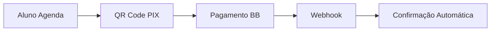

# 🎯 CCI-CA: Visão Geral Completa do Sistema

**Última Atualização:** 12/10/2025  
**Status:** ✅ Sistema Operacional em Produção  
**Novidade:** 🆕 Sistema de Configuração de Taxas e Relatórios de Repasse Implementados!

## 📋 Resumo Executivo

O **Consultório de Aprendizagem CCI-CA** é uma plataforma completa de gestão educacional que integra agendamentos, pagamentos PIX e gestão administrativa em uma solução unificada.

## 🏗️ Arquitetura do Sistema

### **Backend Principal**

-    **cci-ca-api**: Node.js + TypeScript + Express + Supabase
-    **Endpoints**: 30+ APIs ativas (agendamentos, pagamentos, agenda, reagendamento)
-    **Deploy**: Netlify Functions (serverless)

### **Frontends Especializados**

-    **cci-ca-admin**: Interface administrativa completa (React 18 + MUI v5)
-    **cci-ca-aluno**: Portal do aluno com agendamentos completos (React 19 + MUI v6)

### **Banco de Dados**

-    **Supabase PostgreSQL** com views otimizadas
-    **Tabelas principais**: agendamentos, templates, exceções, pagamentos
-    **Triggers automáticos** para gestão de vagas e status

## 🎯 Funcionalidades Principais

### **1. Sistema de Agendamentos Completo**

**Portal do Aluno (IMPLEMENTADO):**

-    ✅ **Criação de agendamentos**: Interface completa por modalidade
-    ✅ **Visualização e gestão**: Lista com cancelamento
-    ✅ **Pagamento PIX integrado**: QR Code e confirmação automática
-    ✅ **Serviço híbrido**: Supabase + API para performance

**Portal Admin (IMPLEMENTADO):**

-    ✅ **Gestão de agenda diária**: 7 componentes especializados
-    ✅ **Templates de recorrência**: Geração automática de horários
-    ✅ **Sistema de exceções**: Feriados, férias, bloqueios
-    ✅ **Estatísticas em tempo real**: Dashboard completo

### **2. Sistema de Pagamentos PIX**

**Fluxo Automático:**



**Características:**

-    ✅ Integração Banco do Brasil via IS Cobrança API
-    ✅ Confirmação instantânea via webhook
-    ✅ Códigos únicos de conciliação
-    ✅ Zero intervenção manual

### **3. Modalidades de Aula**

| Modalidade      | Tipo Pagamento | Max Alunos | Duração | Status    |
| --------------- | -------------- | ---------- | ------- | --------- |
| Aula Particular | Sob demanda    | 1          | 1h      | ✅ Ativo  |
| Aula em Grupo   | Sob demanda    | 10         | 1h30    | ✅ Ativo  |
| Pré-Prova       | Sob demanda    | 3          | 2h      | ✅ Ativo  |
| Turmas Mensais  | Mensalidade    | -          | 1h30    | 🔄 Futuro |

### **4. Sistema de Reagendamento**

**Para Aulas Já Pagas:**

-    ✅ Manutenção do mesmo pagamento PIX
-    ✅ Gestão automática de vagas (libera/ocupa)
-    ✅ Motivos: doença, feriado, outros
-    ✅ Auditoria completa de mudanças

### **5. Sistema Financeiro/Contratos (ADMIN)**

**📋 Gestão de Matrículas:**

-    ✅ **MatriculasPagas**: Sistema completo para matrículas quitadas
-    ✅ **MatriculasNaoPagas**: Gestão de pendências
-    ✅ **GerarParcelasModal**: Geração automática de parcelas subsequentes

**📄 Gestão de Contratos:**

-    ✅ **GerarContrato**: Sistema de criação de contratos
-    ✅ **ListarContratos**: CRUD completo de contratos
-    ✅ **ListarContratosPdf**: Gestão de documentos PDF
-    ✅ **ManterContrato**: Manutenção e edição

**💰 Sistema de Parcelas:**

-    ✅ **ParcelasGeradas**: Listagem e gestão de parcelas
-    ✅ **Sistema de Descontos**: Vencimento, especial, P3, P5
-    ✅ **Configuração de Vencimento**: Dia personalizável por contrato
-    ✅ **Auditoria Completa**: Registro de todas as operações

**📊 Integração de Dados:**

-    ✅ Tabelas: `alunos_contrato_turmas`, `contrato_ano_pessoa`
-    ✅ Views otimizadas para consultas financeiras
-    ✅ Sistema de aprovação com pessoa autorizadora

### **6. Sistema de Configuração de Taxas (NOVO - 12/10/2025)** 🆕

**⚙️ Configuração por Modalidade:**

-    ✅ **Taxas Padrão**: Definir taxas default por modalidade de aula
-    ✅ **PIX e Boleto Separados**: Configuração individual para cada tipo
-    ✅ **Tipo de Taxa**: Percentual ou Valor Fixo
-    ✅ **Ativação/Desativação**: Controle de configurações ativas

**👤 Configuração por Participante:**

-    ✅ **Taxas Específicas**: Configuração personalizada por professor
-    ✅ **Período de Vigência**: Data início/fim da configuração
-    ✅ **Sobrescrever Padrão**: Prioridade sobre configuração da modalidade
-    ✅ **Pausar/Reativar**: Suspensão temporária de configurações
-    ✅ **Histórico Completo**: Auditoria de todas as alterações

**📊 Relatórios de Repasse:**

-    ✅ **Cálculo Automático**: Repasses calculados por configurações efetivas
-    ✅ **Filtros Avançados**: Data, professor, modalidade, tipo pagamento
-    ✅ **Estatísticas**: Totais, médias, distribuições
-    ✅ **Exportação**: CSV e PDF (em desenvolvimento)

**🔐 Controle de Acesso:**

-    ✅ **Apenas Administradores**: tipo_pessoa = 8
-    ✅ **Menu Protegido**: Filtrado para usuários sem permissão
-    ✅ **Rotas Protegidas**: Dupla camada de segurança

## 📊 Status Atual dos Projetos

### **✅ Prontos para Produção:**

1. **cci-ca-api** - Backend completo (100%)
     - ✅ 40+ endpoints ativos
     - ✅ Sistema de Configuração de Taxas implementado 🆕
     - ✅ Relatórios de Repasse funcionais 🆕
2. **cci-ca-admin** - Interface administrativa COMPLETA (100%)
     - ✅ Sistema de Agenda Diária completo
     - ✅ Sistema Financeiro/Contratos COMPLETO
     - ✅ Gestão de Matrículas e Parcelas
     - ✅ Sistema de Configuração de Taxas 🆕
     - ✅ Relatórios de Repasse com filtros 🆕
3. **cci-ca-aluno** - Portal com agendamentos completos (85%)

## 🔄 Fluxos Principais do Sistema

### **Fluxo 1: Agendamento e Pagamento**

```
1. Aluno acessa portal → seleciona modalidade
2. Visualiza slots disponíveis → escolhe professor/horário
3. Sistema gera QR Code PIX → aluno paga
4. Webhook confirma pagamento → agendamento ativado
5. Notificações automáticas → professor e aluno
```

### **Fluxo 2: Gestão de Agenda (Admin)**

```
1. Admin acessa sistema → cria templates recorrentes
2. Sistema gera slots automaticamente → publica para alunos
3. Gestão de exceções → feriados, férias, bloqueios
4. Monitoramento em tempo real → ocupação e receita
```

### **Fluxo 3: Reagendamento de Aula Paga**

```
1. Verificação → apenas aulas confirmadas (pagas)
2. Seleção → nova data/horário disponível
3. Execução → libera vaga origem, ocupa destino
4. Manutenção → mesmo pagamento PIX
5. Registro → auditoria completa da mudança
```

## 🎯 Capacidades Atuais

### **Para Alunos:**

-    ✅ Agendar aulas particulares, em grupo, pré-prova
-    ✅ Pagar via PIX com confirmação instantânea
-    ✅ Visualizar agendamentos e status
-    ✅ Cancelar agendamentos quando necessário

### **Para Professores:**

-    ✅ **Sistema de Filtros Implementado**: Acesso controlado via Portal Admin
-    ✅ **Gestão de Agendamentos**: Visualização e gerenciamento de aulas próprias
-    ✅ **Gestão de Alunos**: Visualização de alunos matriculados em suas turmas
-    ✅ **Espaços de Aula**: Criação e gerenciamento de espaços para agendamentos
-    ✅ **Controle de Sessão**: Autenticação automática com filtros por disciplinas/turmas

### **Para Administradores:**

-    ✅ Gestão completa de agenda diária
-    ✅ Criação de templates e exceções
-    ✅ Monitoramento de agendamentos e pagamentos
-    ✅ Relatórios e estatísticas em tempo real

## 🚀 Próximas Implementações

### **Curto Prazo:**

1. **Portal do Professor**: Sistema completo de agenda
2. **Migração Financeira**: Do projeto separado para portal aluno

### **Médio Prazo:**

1. **Turmas Mensais**: Contratos anuais com parcelas - PORTAL DO ALUNO

## 🔧 Links e Recursos

### **URLs Principais:**

-    **API Principal**: `https://cci-ca-api.netlify.app`
-    **Portal Admin**: `https://cci-ca-admin.netlify.app`
-    **Portal Aluno**: `https://cci-ca-aluno.netlify.app`

### **Documentação Técnica:**

-    [Guia da API Agenda Diária](./como-usar-api-agenda-diaria.md)
-    [Sistema de Reagendamento](./como-usar-sistema-reagendamento-aulas.md)
-    [Templates de Recorrência](./TEMPLATES-RECORRENCIA-SISTEMA.md)

---

**Conclusão**: O CCI-CA é um sistema robusto e funcional, com 3 dos 4 módulos principais prontos para produção. O foco atual é finalizar o portal do professor e consolidar a migração financeira.
